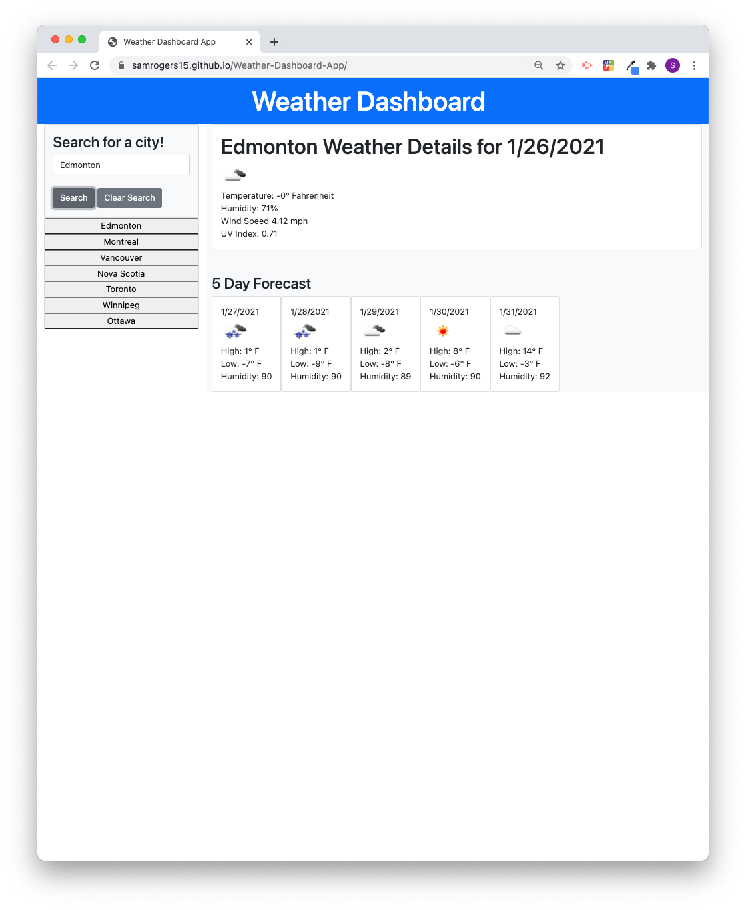

# Weather Dashboard Application
> This application was created to provide a user with current and future weather information for a given city input by the user. Upon searching a city, the user is provided with the current weather for that city as well as the 5 day forecast for that city. Additionally, the city that was searched is saved to the app and functions as a button for the user to click on at a later date to reload the weather information for that city.
 
## Table of contents
* [User story](#user-story)
* [General info](#general-info)
* [Screenshots](#screenshots)
* [Technologies](#technologies)
* [Live link](#live-link)
* [Sources](#sources)
* [Contact](#contact)

## User story
AS A traveler
I WANT to see the weather outlook for multiple cities
SO THAT I can plan a trip accordingly

## General info
A user can type in a city and gain access to weather information for that city. All previously searched cities are saved to the local storage on the user's browser and previous searches are appended to the page and function as buttons so that the user can click a previously searched city and again be provided with the weather information for that city. If a user clicks off of the page and re-loads it at a later date, the weather information for the last searched city is automatically loaded on the page. And finally, the user is provided with a button that clears the previously searched cities by clearing out the browser's local storage for the specific key that the search terms are saved under.

## Screenshots

## Technologies
* HTML
* CSS
* JQuery
* AJAX

## Live link
Click here to see the [Weather Dashboard App](https://samrogers15.github.io/Weather-Dashboard-App/) in action!

## Sources
Application enabled using OpenWeather API - please see [here](https://openweathermap.org/).

## Contact
Created by Sam Rogers

[LinkedIn](https://www.linkedin.com/in/samuelerogers/)

[Portfolio](https://samrogers15.github.io/Current_Portfolio/index.html)

Feel free to contact me!